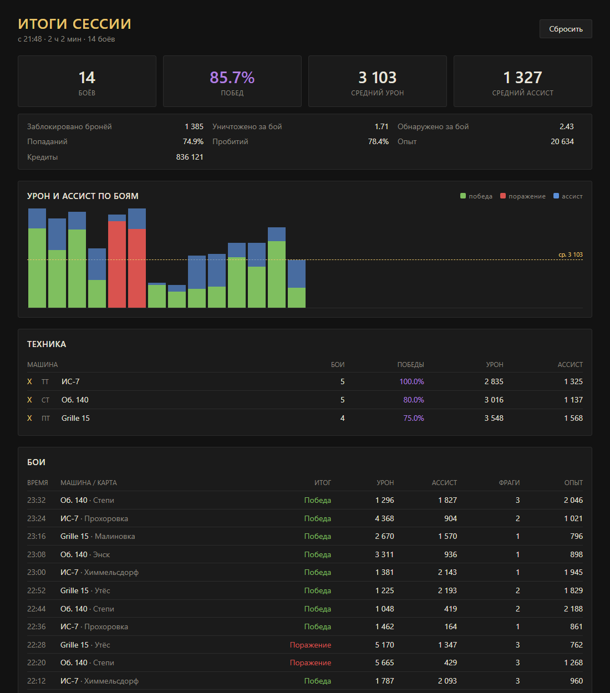

# Session Stats — итоги игровой сессии для «Мира танков»

Мод считает статистику боёв с момента входа в игру и показывает её в отдельной панели прямо в клиенте:
процент побед, средний урон и ассист, точность, опыт и кредиты, разбивку по технике и список боёв.

После каждого боя в центр уведомлений приходит короткая сводка, а полная панель открывается
из списка модов (кнопка в ангаре от [ModsListAPI](https://github.com/poliroid/modslist)).



## Установка

1. Скачать `.mtmod` со страницы [Releases](../../releases).
2. Положить в `<папка игры>/mods/<версия клиента>/`, например `C:/Games/Tanki/mods/1.45.0.0/`.
3. Для кнопки открытия панели нужен ModsListAPI (обычно уже стоит вместе с другими модами).

Проверено на клиенте 1.45.0.0.

Настройки лежат в `mods/configs/session_stats/config.json`:

| параметр | по умолчанию | |
|---|---|---|
| `port` | `16150` | порт локального сервера; если занят, берётся следующий |
| `sessionIdleHours` | `4` | если не играл дольше, при следующем запуске начнётся новая сессия |
| `notifyAfterBattle` | `true` | сводка в уведомлениях после боя |

## Как устроено

```
mod/scripts/client/gui/
  mods/mod_session_stats.py     точка входа, клиент вызывает init()/fini()
  session_stats/
    controller.py               связь с игрой: события, кэш результатов, уведомления, кнопка
    parser.py                   разбор результатов боя в BattleRecord
    models.py                   BattleRecord, Totals, Session
    metrics.py                  показатели (Total / Average / Ratio)
    server.py                   HTTP-сервер на 127.0.0.1 для панели
ui/                             панель на React + TypeScript (Vite)
tests/                          unittest, гоняются на Python 2.7 и 3
build.py                        сборка .mtmod
```

**Откуда берутся данные.** После боя сервер присылает в сервисный канал сообщение `battleResults`.
Мод ловит его через `g_messengerEvents.serviceChannel.onChatMessageReceived`, берёт `arenaUniqueID`
и запрашивает полные результаты у `BigWorld.player().battleResultsCache`. Запрос делается с задержкой:
клиент в этот момент сам загружает те же результаты, и если дать ему закончить, наш запрос
отдаётся из локального кэша без обращения к серверу. Если кэш занят, запрос повторяется.

Старые сообщения, которые сервер присылает при входе в игру, отсекаются по времени начала боя
(младшие 32 бита `arenaUniqueID`) — в сессию попадают только бои после её начала.

**Панель.** Встроить новое окно Gameface из мода нельзя: вьюхи регистрируются по `layoutID` из
сгенерированных ресурсов клиента. Поэтому панель — это React-приложение, которое открывается
во встроенном браузере клиента (`showBrowserOverlayView`), а данные получает от мода по HTTP.

Сервер крутится в отдельном потоке и игровые объекты не трогает: он отдаёт заранее собранный
JSON-снимок, а команды (сброс сессии) кладёт в очередь, которую основной поток разбирает
по таймеру `BigWorld.callback`.

**Показатели.** Каждый показатель — класс-наследник `Metric` с методами `value()` и `format()`.
Чтобы добавить новый, достаточно дописать его в `METRICS`: он появится и в API, и в панели.
`Totals` складываются через `+`, поэтому сумма по боям считается обычным `sum()`.

## Разработка

Нужны Python 3, Python 2.7 (клиент игры работает на 2.7) и Node.js 20+.

```bash
# тесты логики
python -m unittest discover -s tests

# интерфейс с тестовыми данными: http://localhost:5173/?mock
cd ui && npm install && npm run dev

# если игра запущена с модом, dev-сервер проксирует /api в игру - можно верстать на живых данных

# сборка и установка
PY27=C:/Python27/python.exe python build.py --install C:/Games/Tanki
```

Логи мода пишутся в `python.log` в папке игры с префиксом `[session_stats]`.

## Планы

- перенести панель на Gameface, когда появится способ регистрировать свои вьюхи
- WN8 / эффективность по таблице ожидаемых значений
- фильтр по режимам боя

## Лицензия

MIT
